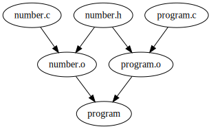

Lab 1
=====

Submit the solution of this task according to the
[Submitting instructions](#submitting) before Tuesday Oct 7 23:59:59.

To correctly submit this task:

1. Fill out the
   [registration form](https://docs.google.com/forms/d/e/1FAIpQLSecsq105KGt7RRPtANcgZSllwYPWCS67Ez_TwstC5265C-KEA/viewform)
   so that we can create your private repository.
2. Go over the [first task (programs and dynamic libraries)](#programs-and-dynamic-libraries).
3. Solve the [second task](#makefile) by creating a `Makefile` as specified (and copy / save
   it).
4. When your private repository gets created, submit it according to the
   [submitting instructions](#submitting)

*Note*: right now, to get the files used in this assignment, you can clone this
(public) repository with `git clone https://github.com/FMFI-UK-2-AIN-118/osprog.git`.
Later, once your private repository is set up, you will want to clone your private fork.

Tasks
-----

1. [Programs and dynamic libraries](#programs-and-dynamic-libraries)
2. [Makefile](#makefile)

### Programs and dynamic libraries

Go over the following "tutorial"  (and try it for yourself!):

- [compiling a simple C program](#simple-program)
- [compiling a C program consisting of multiple units](#multiple-units)
- [compiling dynamic libraries](#dynamic-libraries)
- [running dynamically linked programs](#running-dynamically-linked-programs)

#### Simple program

Lets start with a very simple C program ([simple.c](simple.c)):

```c
int main(int argc, char *argv[])
{
	return 0;
}
```

We can compile it by running `gcc`:

```sh
$ gcc -o simple simple.c
```

Simple! We are using the `-o simple` option to specify an output file (otherwise
gcc would use the default name of `a.out`, you can google the historic reasons
for that ;).

Lets check that it actually works:

```sh
$ ./simple
$ echo $?
0
```

The command `echo $?` prints out the return code of the last executed command,
so we can see that `simple` really return `0`.

The gcc command performed several steps for us, which is handy when compiling a
simple program, but might not be correct for bigger applications:

- first it **compiled** the source `.c` file (which is also called a
  *compilation unit*) into an *object file* (which would normally be called
  `simple.o`),
- then it **linked** the object file with any required libraries (such as the
  "built in" c library or any other libraries we might mention on the command
  line)

If we wanted to do this manually, we would have first to actually compile the
source (thus creating the object file):

```sh
$ gcc -c -o simple.o simple.c
```

and then "link" it with any standard libraries to produce the actual executable:

```sh
$ gcc -o simple simple.o
```

#### Multiple units

For larger applications, source code is often split into multiple files. A (very
simplistic) example can be seen in the files [`number.h`](number.h),
[`number.c`](number.c) and [`program.c`](program.c).

Gcc can again do all the necessary steps for us when compiling the program:

```sh
$ gcc -o program program.c number.c
$ ./program
$ echo $?
47
```

This has however various disadvantages:

- if we change even only one of the input files, all compilation units (c source
  files) would be recompiled;

- sometimes one unit (source file) can be used to generate multiple binaries,
  thus being compiled over and over, although it might not make sense to break
  it out to an actual library.

Because of this C code is usually compiled in the way we've seen before: first
compiling the individual source units into object files and then linking them
together as needed.

By the way: static libraries are really nothing else then
just a collection of object files.

To compile our example program we would really do:

```sh
# compile program.c into program.o
$ gcc -c -o program.o program.c

# compile number.c into number.o
$ gcc -c -o number.o number.c

# link them together
$ gcc -o program program.o number.o
$ ./program
$ echo $?
47
```

Note that we actually compiled `program.c` before `number.c`: it does not really
matter, as long as the header files correctly specify the "interface".

##### A note on dependencies

When building larger projects, we usually talk about **dependencies**.
Informally a file `A` depends on file `B` if a change in `B` means that `A`
has to be updated to reflect those changes (note that this is a transitive
relation ;).

For  C / C++:
- Object files (`.o`) depend on the corresponding unit they were compiled from
  (i.e. a `.c` or `.cpp` file) and any (recursively) `#include`-d files.
- Executables depend on the object files they are assembled from.

Note that technically the objects and binaries depend also on the system includes
(`<stdio.h>`, `<iostream>` and similar) and the compiler itself, but we normally
don't consider them because we don't expect them to change while we work on a
program `;)`.



#### Dynamic libraries

Even if we "reuse" object files (either manually or as static libraries) to
create multiple executables, the final executables would have a lot of code
duplicated. This would lead for example for the standard library to be included
in every C application.

To avoid this, operating systems can use dynamic libraries: code will not be
present directly in the executable, but when the operating system runs it, it
will find all the (dynamic) libraries (DLLs on Windows and .so-s on linux) and
"include" them in the process.

Lets have a closer look at our executable `program`:

```
$ file program
program: ELF 64-bit LSB executable, x86-64, version 1 (SYSV), dynamically linked,
interpreter /lib64/ld-linux-x86-64.so.2, for GNU/Linux 2.6.32, not stripped

$ ls -l program
-rwxr-xr-x 1 yoyo users 7968 Sep 26 04:11 program

$ ldd program
        linux-vdso.so.1 (0x00007ffcb95ec000)
        libc.so.6 => /lib64/libc.so.6 (0x00007f8af47f6000)
        /lib64/ld-linux-x86-64.so.2 (0x00007f8af4b8f000)
```

The important bits are: it is a dynamically linked executable; it is just under
8kB and it references 3 other libraries (although two of them are sort of
"fake": the first one is provided by kernel, and the last one is the actual
dynamic loader).

The `libc.so.6` is actually the "dynamic" version of the standard C library,

We could also try to build a *static* version of our program, with all the
libraries and code included:

```
$ gcc -static -o  program program.c number.c

$ file program
program: ELF 64-bit LSB executable, x86-64, version 1 (GNU/Linux), statically linked, for GNU/Linux 2.6.32, not stripped

$ ls -l program
-rwxr-xr-x 1 yoyo users 948352 Sep 26 04:24 program

$ ldd program
        not a dynamic executable
```

Now it's almost 1MB because it contains all the required code from standard
library.

Note: the "not stripped" part actually tells us, that our executable contains a
bit more that is really needed to run it, usually helpful for debugging or
further processing of the executable (note: we did not actually include any real
debugging information, try compiling the program with `-g`). To actually remove
all the extra information, you can use the `strip` command:

```
$ strip program
$ ls -l program
-rwxr-xr-x 1 yoyo users 730312 Sep 26 04:25 program
```


##### Compiling dynamically linked programs and libraries

To actually compile a dynamically linked application or binary, one additional
problem needs to be taken care of: we need to tell the compiler to create
code that works even when it is loaded in different parts of memory.

*Questions to google: why? How does static compilation work? How are symbol
(function) addresses resolved when dynamically linking?*

To achieve that, we need to pass the `-fPIC` (Position Independent Code) to the
compiler when compiling code that will be dynamically loaded:

    $ gcc -c -o number.o -fPIC number.c

We can then "link" it into a shared library:

    $ gcc -o libnumber.so -shared number.o

Note: shared libraries on linux are always named `libLIBRARYNAME.so`, this is a
convention used by the linker and loader to find the library files. Libraries
are also usually versioned (i.e. `libsomething.so.10.2`) to allow multiple ABI
to coexist on a single computer.

*Question to google: what is an ABI?*

After that we can compile and link the actual executable:

    $ gcc -c -o program.o -fPIC program.c
    $ gcc -o program program.o -lnumber -L.

This time, when linking the program we specified the library(ies) to link
against and, because it is not present in a standard directory, also the path
where to find it (`.`). Note that the `lib` prefix and `.so` suffix is added by
the linker.

*Question: is the `-fPIC` option needed also for the executable itself?*

#### Running dynamically linked programs

Lets try to run our freshly new dynamically linked executable:

```
$ ./program 
./program: error while loading shared libraries: libnumber.so: cannot open shared object file: No such file or directory
```

Oops, that didn't go that well. The problem is similar to why we needed to add
the `-L.` option: the dynamic loader looks for the libraries only in predefined
system locations.

*Question to google: what are the default locations that are searched by the
dynamic loader on linux when it looks for libraries? Where/how are these
configured?*

On linux this is similar also when actually looking up programs (i.e. why we
need to include `./` when running our program).

*Note: Windows do actually look for executables and DLLs in current directory,
which could be considered a security risk. Question: why?*

Let's check again with `ldd`:

```
$ ldd ./program
        linux-vdso.so.1 (0x00007fff947fc000)
        libnumber.so => not found
        libc.so.6 => /lib64/libc.so.6 (0x00007fccea578000)
        /lib64/ld-linux-x86-64.so.2 (0x00007fccea911000)
```

Fortunately we can tell the loader (program that actually loads our executable
and then all its libraries into memory) to look in custom directories by setting
the `LD_LIBRARY_PATH` environment variable:

```sh
$ export LD_LIBRARY_PATH=$PWD
$ ldd ./program
        linux-vdso.so.1 (0x00007ffe3b2d6000)
        libnumber.so => /home/yoyo/osprog/osprog/l01/libnumber.so (0x00007f8cceb45000)
        libc.so.6 => /lib64/libc.so.6 (0x00007f8cce7ac000)
        /lib64/ld-linux-x86-64.so.2 (0x00007f8cced47000)
$ ./program
$ echo $?
47
```

*Question: why did we use `$PWD` instead of just `.`?*


#### Why is the small program not so small?

*Note: this section is a bit more technical and you can skip it directly to the
[Makefile task](#Makefile) if you are not interested.*

What's the actual size of our "smallest" C program?

```sh
$ ls -l simple
-rwxr-xr-x 1 yoyo users 7896 Sep 26 03:08 simple
```

Almost 8kb! Not very big, but more then we would expect for program that does
nothing except returning zero... Why is it so big? The answer lies in two
things: executable formats and libraries:

- Each operating system needs more then just the machine code to run a program:
  "type" of the machine code (32bit? 64bit? arm? intel?...), address where the
  code starts, any dynamic libraries and symbols it might use, data section with
  pre-filled data etc. On windows the usual format for binaries is EXE (though
  that's a bit of a simplification) on linux ELF.

- Our program really does more then just returning a number. The C standard says
  that the `main` function will be executed and its return value will be the
  exit value of our program, but the machine code might have to do more,
  variables might need to be initialized etc.
  Similarly, the standard says that a function like `printf` should format text
  and print it, but that's not an operating system "function", so the code must
  come from somewhere. All this is included in what is called the standard C
  library. Although we are not using functions like `printf`, gcc still included
  parts of it to handle program startup and exit.

Lets see what we actually got:

```
 $ objdump -h simple

simple:     file format elf64-x86-64

Sections:
Idx Name          Size      VMA               LMA               File off  Algn
...
 11 .text         00000171  0000000000400410  0000000000400410  00000410  2**4
                  CONTENTS, ALLOC, LOAD, READONLY, CODE
...
```

The `objdump -h` command lists "sections" inside an ELF binary. The section that
contains actual code is called `.text`. We can see that it is actually 0x171
(i.e. 369) bytes long. You can try and google what the other sections are for.

Lets see what code we actually have. `objdump -d` will give us a disassembly of
all sections that contain code:

```
$ objdump -d simple

simple:     file format elf64-x86-64


Disassembly of section .init:

00000000004003c0 <_init>:
...

Disassembly of section .text:

0000000000400410 <_start>:
...

0000000000400506 <main>:
  400506:       55                      push   %rbp
  400507:       48 89 e5                mov    %rsp,%rbp
  40050a:       89 7d fc                mov    %edi,-0x4(%rbp)
  40050d:       48 89 75 f0             mov    %rsi,-0x10(%rbp)
  400511:       b8 00 00 00 00          mov    $0x0,%eax
  400516:       5d                      pop    %rbp
  400517:       c3                      retq
  400518:       0f 1f 84 00 00 00 00    nopl   0x0(%rax,%rax,1)
  40051f:       00

...
```

We can see that there's actually some code in other sections and also more then
our `main` function in the `.text` section. These are functions from the
standard library that handle initialization and "finalization" of any standard
library / C features as well as the actual startup and exit of our program.

Because we didn't compile the binary as a static executable, only parts that are
really needed were included (though this is a big simplification ;) and a lot of
other parts would be loaded dynamically:

```
$ ldd ./simple
        linux-vdso.so.1 (0x00007ffeb81fc000)
        libc.so.6 => /lib64/libc.so.6 (0x00007f0375be3000)
        /lib64/ld-linux-x86-64.so.2 (0x00007f0375f7c000)
```

If you first compile the source code into an object file, you can use `objdump`
on the object file to actually see that it really contains only our code (plus
information needed to actually link it).


### Makefile

Create a `Makefile` with the following targets:

- *default target* (invoked by just running `make`): compile the program
  and library from the [dynamic library example](#dynamic-libraries). This
  should create two files (binaries) named `program` and `libnumber.so`.
  (plus any auxiliary files used during the compilation).
- `clean`: remove any auxiliary files created during the compilation,
  but leave the program and library.
- `distclean`: remove all generated files (targets and also aux files).
- `test`: run the program and display the returned value.

The default target should correctly rebuild the targets if the sources change
(hint: the program must be recompiled if the header from the library changes).
There is a `test.sh` script that checks some of your `Makefile` functionality
(but not everything).

**Bonus**: try to create as smallest `Makefile` as possible. (Note: whitespace
doesn't count, try to keep it as readable as possible. Also: make's
[automatic variables](https://www.gnu.org/software/make/manual/make.html#Automatic-Variables)
and [builtin rules](https://www.gnu.org/software/make/manual/make.html#make-Deduces)
are your friends).

*Hint:* A Makefile with a single rule, ~to rule them all,~ like the one shown just below (collecting
the commands mentioned in above sections), won't work correctly, because it
will rebuild everything everytime. Ideally you need to specify for each file
separately how it is build and what are the inputs.

```Makefile
program: program.c number.c number.h
	gcc -c -o program.o program.c
	gcc -c -o number.o -fPIC number.c
	gcc -o libnumber.so -shared number.o
	gcc -o program program.o -L. -lnumber
```

*Hint:* `distclean` is a superset of `clean`.

*Hint:* the last (`test`) target is tricky `;-)`. You need to
set `LD_LIBRARY_PATH`,
[get the return value / exit code](https://www.google.com/search?q=get+return+value+of+previous+command+in+shell)
of the program, and display it, all in one shell invocation and make sure
nothing else is printed.

#### About Makefiles

Makefiles are collections of recipes that specify how files (programs,
libraries) should be created. You can either (try to) read the
[official make manual](https://www.gnu.org/software/make/manual/make.html)
or google some tutorials. A very short introduction follows here.

A single recipe in a Makefile looks like this:

```
target: dep1 dep2...
<one tab>command1
<one tab>command2
...
```

`target` is the name of the final file that will be created, `dep1`... are the
names of files that `target` is generated from (i.e. depends on them). Whenever
dependencies change, `make` will re-run the commands to (re)generate the `target`.

Each [command (line)](https://www.gnu.org/software/make/manual/make.html#Recipe-Syntax)
is invoked in a separate shell invocation. If you are writing multiple commands
that must share the same shell environment (i.e. check the return code of the
previous command, set/use variables etc.), those must be on one line, separated
with the usual shell operators (`;`, `&&`, ...). You can also use `\` at the end
of a line to make a "line continuation", so they don't really have to be on the
same physical line.

```Makefile
wontWork:
	x=ahoj
	echo $$x

works:
	x=ahoj ; echo $$x

splitIntoMultipleLines:
	for x in ahoj caf ; do \
		echo $$x ; \
	done
```

Note also that `$` has a special meaning in `make` (is used to reference
[make variables](https://www.gnu.org/software/make/manual/make.html#Reference)),
so it must be "escaped" with another `$` to properly pass a single `$` to the
shell.

If any of the commands fail (return non-zero status), make will fail.

The first target in a Makefile is called the default target and will be built
when `make` is called without any arguments

There can be `target`s whose commands don't really generated the target file.
These are called "phony" targets and `make` will run the associated commands
every time they are requested. It is nice to list them as dependencies of a special
`.PHONY` target (as can be seen in the following example) which tells `make` that it
really doesn't have to check for the output file and can treat them specially.

The following example "renders" a php file into HTML or plain text (using the `lynx`
command / commandline browser), assuming `page.php` includes another file
`header.php`:

```Makefile
.PHONY: default
default: page.html

page.html: page.php header.php
	php page.php >page.html

page.txt: page.html
	lynx -dump page.html >page.txt

.PHONY: show
show: page.txt
	@echo "Generated plaintext:"
	@cat page.txt
```

Normally `make` prints all the commands being executed. This can be disabled for
specific commands by prepending `@` as seen with the `echo` and `cat` commands in the
example. Note that the php and lynx commands get still printed if you call `make
show` when the html and txt files are not yet generated.

Submitting
----------

Submit your solution by committing required files (`Makefile`) under the
directory `l01` and creating a pull request against the `l01` branch.

A correctly created pull request should appear in the
[list of PRs for `l01`](https://github.com/pulls?utf8=%E2%9C%93&q=is%3Aopen+is%3Apr+user%3AFMFI-UK-2-AIN-118+base%3Al01).
